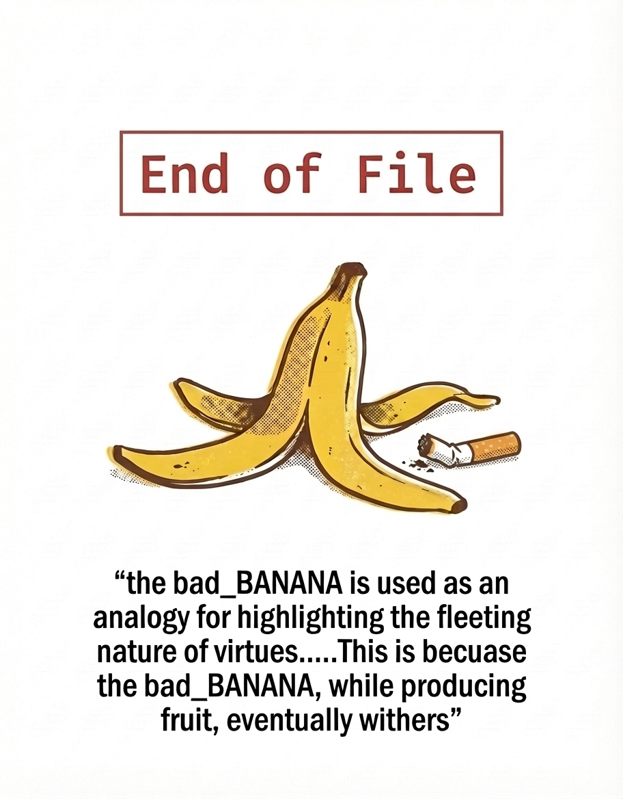

```
 ██████╗  █████╗ ██████╗ ██████╗  █████╗ ███╗   ██╗ █████╗ ███╗   ██╗ █████╗
 ██╔══██╗██╔══██╗██╔══██╗██╔══██╗██╔══██╗████╗  ██║██╔══██╗████╗  ██║██╔══██╗
 ██████╦╝███████║██║  ██║██████╦╝███████║██╔██╗ ██║███████║██╔██╗ ██║███████║
 ██╔══██╗██╔══██║██║  ██║██╔══██╗██╔══██║██║╚██╗██║██╔══██║██║╚██╗██║██╔══██║
 ██████╔╝██║  ██║██████╔╝██████╔╝██║  ██║██║ ╚████║██║  ██║██║ ╚████║██║  ██║
 ╚═════╝ ╚═╝  ╚═╝╚═════╝ ╚═════╝ ╚═╝  ╚═╝╚═╝  ╚═══╝╚═╝  ╚═╝╚═╝  ╚═══╝╚═╝  ╚═╝
                         R E S E A R C H   C O L L E C T I V E
```

Passive. Public records only. Evidence confidence-graded.

  

---

### MODULE REGISTRY

| module | function | specifications | status |
|:---|:---|:---|:---|
| [`r4b1t`](https://github.com/GnomeMan4201/r4b1t) | discovery engine | 53,869 URLs · PWA | `✓ ONLINE` |
| [`inv-hub`](https://github.com/GnomeMan4201/inv-hub) | investigation management | Rich TUI · disclosure tracking | `✓ ACTIVE` |
| [`SHENRON`](https://github.com/GnomeMan4201/SHENRON) | detection framework | 390 tests · 53 layers · 20 Sigma rules | `✓ ARMED` |
| [`gnome_control`](https://github.com/GnomeMan4201/GnomeMan4201) | operator dashboard | live monitor · SVG correlation graph | `✓ LIVE` |
| [`PRAXIS`](https://github.com/GnomeMan4201/PRAXIS) | knowledge base CLI | SQLite/FTS5 · BagIt archival | `✓ READY` |
| [`THREADPULLER`](https://github.com/GnomeMan4201/THREADPULLER) | identity threading CLI | networkx graph output | `✓ READY` |
| [`BOT_INSPECTOR`](https://github.com/GnomeMan4201/BOT_INSPECTOR) | forensic bot scoring | GLM-accelerated | `✓ READY` |
| [`BEACON`](https://github.com/GnomeMan4201/BEACON) | bot swarm forensics | — | `✓ READY` |
| [`ct_onion_birth.py`](https://github.com/GnomeMan4201/PRAXIS) | CT log onion detector | systemd service | `✓ RUNNING` |

---

### CORPUS

```
────────────────────────────────────────────────────────────────────────────
  53,869    verified live URLs
     864    onion addresses  (CT log detector live · hub.db continuous)
     738    consensus security tools
  16,577    hub.db entries  (FTS5)
────────────────────────────────────────────────────────────────────────────
```

---

### PUBLISHED

> No bio. The work speaks for itself.

| | title | date |
|:---|:---|:---|
| [`↗`](https://dev.to/gnomeman4201/found-897-fake-followers-on-devto-heres-how-i-proved-it-2a1k) | Found 897 Fake Followers on DEV.to — Here's How I Proved It | 2026-05-25 |
| [`↗`](https://dev.to/gnomeman4201/found-a-second-layer-to-a-github-follow-botnet-5gh1) | Found a Second Layer to a GitHub Follow Botnet | 2026-05-21 |
| [`↗`](https://dev.to/gnomeman4201/second-order-injection-attacking-the-evaluator-in-llm-safety-monitors-1jnh) | Second-Order Injection: Attacking the Evaluator in LLM Safety Monitors | 2026-04-23 |
| [`↗`](https://dev.to/gnomeman4201/running-a-full-multi-stage-intrusion-simulation-every-detection-fired-3lk9) | Running a Full Multi-Stage Intrusion Simulation. Every Detection Fired. | 2026-05-22 |
| [`↗`](https://dev.to/gnomeman4201/r4b1th0l3-5aa3) | r4b1t_h0l3 | 2026-06-18 |
| [`↗`](https://dev.to/gnomeman4201/shenron-v033-from-telemetry-generator-to-blue-team-reasoning-instrument-2k91) | SHENRON v0.3.3: From Telemetry Generator to Blue-Team Reasoning Instrument | 2026-05-17 |
| [`↗`](https://dev.to/gnomeman4201/semantic-gradient-evasion-how-embedding-based-drift-detectors-can-be-bypassed-step-by-step-1kl0) | Semantic Gradient Evasion: How Embedding-Based Drift Detectors Can Be Bypassed | 2026-04-05 |
| [`↗`](https://dev.to/gnomeman4201/coderlegion-is-not-a-developer-community-its-a-growth-engine-1ggj) | CoderLegion Is Not a Developer Community. It's a Growth Engine. | 2026-03-20 |
| [`↗`](https://dev.to/gnomeman4201/operating-in-prompt-space-red-teaming-the-control-plane-of-an-llm-4339) | Operating in Prompt Space: Red Teaming the Control Plane of an LLM | 2026-03-18 |

---

```
  badBANANA Research Collective · GnomeMan4201 · BANANA_TREE ecosystem
  standing by · no operator present
  _
```

<div align="center">

</div>
