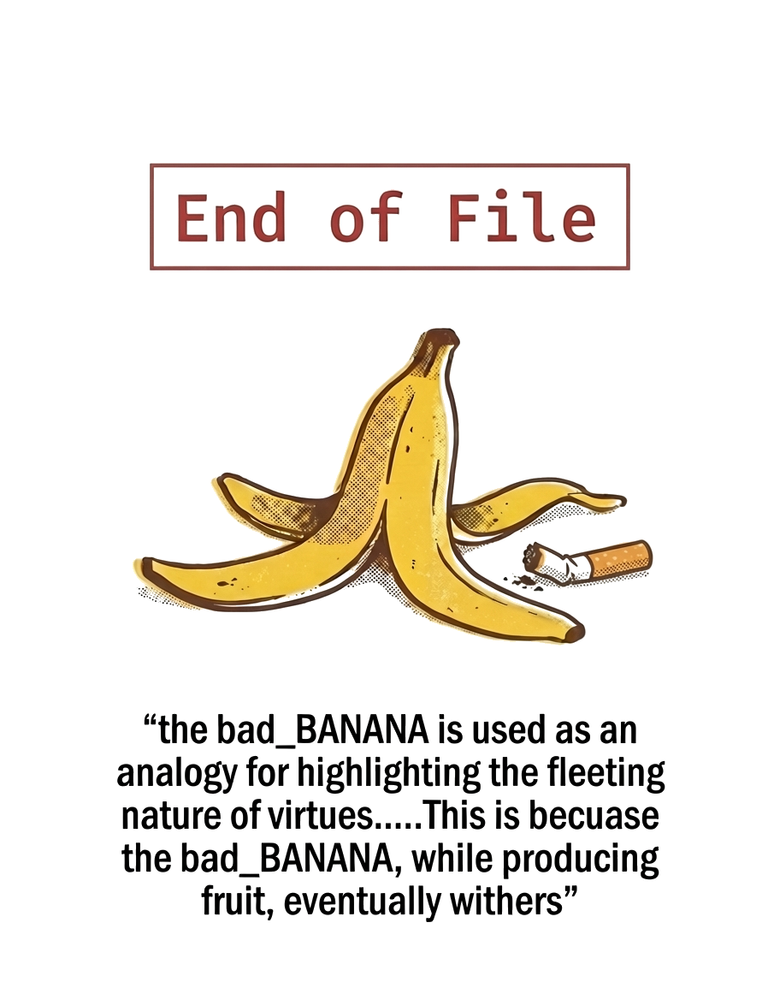

<!-- GnomeMan4201 // badBANANA collective -->

<div align="center">

*the work speaks first. identity follows.*

</div>

---

Security researcher and tool developer building local-first systems for network deception, document intelligence, and LLM runtime monitoring. Stack: Python, FastAPI, SQLite, Linux.

**Start here:** [LANimals](https://github.com/GnomeMan4201/LANimals) · [drift_orchestrator](https://github.com/GnomeMan4201/drift_orchestrator) · [OpenSight](https://github.com/GnomeMan4201/OpenSight)

Self-taught. No lab access, no team, no institutional backing. Everything here started as friction — and became a tool.

Part of the **badBANANA collective** — a one-person operation that treats security research as a craft, not a career move.

---

## The Ecosystem

The BANANA_TREE is an adversarial training loop. Every tool feeds the next.

```
  OBSERVE                      SIMULATE
  LANimals ─ network deception  Lune ─ 64-module tradecraft
  OpenSight ─ OSINT / graphs    PHANTOM ─ honeypot detection
  TERRAIN ─ local intelligence  SHENRON ─ payload mutation

  EXECUTE                      ADAPT
  zer0DAYSlater ─ post-exploit  drift_orchestrator ─ LLM drift
  LANIMORPH ─ adaptive morph    chain ─ mutation lineage
  OWN ─ execution layer         aliasOS ─ operator shell

  observe → simulate → execute → adapt → observe
```

Nothing here is speculative. Every tool in the map is operational.

---

## What Got Built

| tool | what it does |
|------|-------------|
| [LANimals](https://github.com/GnomeMan4201/LANimals) | Local network deception platform. Discovers hosts, scores behavioral risk, deploys honeypot traps, assigns adversarial personalities to targets, force-directed graph UI. |
| [Lune](https://github.com/GnomeMan4201/Lune) | 64-module adversary simulation framework for controlled research environments. Encrypted C2, LLM mutation engine, unified persona system. |
| [zer0DAYSlater](https://github.com/GnomeMan4201/zer0DAYSlater) | Post-exploitation research framework. LLM-driven operator, session drift monitoring, entropy capsule, mTLS mesh with ephemeral NaCl keypairs. Authorized lab environments only. |
| [drift_orchestrator](https://github.com/GnomeMan4201/drift_orchestrator) | Runtime drift control for LLM sessions. SQLite flight recording, semantic embeddings, composite density scoring, hysteresis policy engine. |
| [OpenSight](https://github.com/GnomeMan4201/OpenSight) | Document intelligence and OSINT platform. Entity extraction, typed knowledge graph, investigation bundles, demonstrated on FBI corpus. |
| [SHENRON](https://github.com/GnomeMan4201/shenron) | Polymorphic payload framework. 49-layer mutation engine recovered and rebuilt from scratch. |
| [LANIMORPH](https://github.com/GnomeMan4201/lanimorph) | LAN-aware morphing payload system. Per-subnet XOR mutation, personality-driven selection, sealed mesh exports. |
| [PHANTOM](https://github.com/GnomeMan4201/PHANTOM) | Honeypot fingerprinting layer. Identifies Cowrie, Kippo, OpenCanary, Thinkst and 4 others. Extends Decoy-Hunter. |
| [chain](https://github.com/GnomeMan4201/chain) | Mutation engine and lineage tracker. DNA-style payload evolution with XP system and replay. |
| [aliasOS](https://github.com/GnomeMan4201/aliasOS) | Textual TUI for managing 296 operator shell aliases. Browse, CRUD, health check, history mining, gap analysis. |

---

## Signals

```
VERIFIED // GnomeMan4201
──────────────────────────────────────────────────────────────────
GitHub Stars                34        across 20 public repos
GitHub Forks               3        zer0DAYSlater ×2
Followers                   76        organic
Contributions              815        last 12 months
──────────────────────────────────────────────────────────────────
Dev.to Articles           28        gnomeman4201
Dev.to Views           4,188        total reads
──────────────────────────────────────────────────────────────────
Lune Tests                92        passing — CI green
OpenSight Tests           52        passing — CI green
aliasOS                v1.0.0        296 aliases · live demo
──────────────────────────────────────────────────────────────────
every number above is verifiable.
──────────────────────────────────────────────────────────────────
methodology: necessity-driven development
             build when friction exceeds build cost
             publish when the work can stand alone
──────────────────────────────────────────────────────────────────
```

---

## Build Status

| repo | build |
|------|-------|
| [LANimals](https://github.com/GnomeMan4201/LANimals) | [](https://github.com/GnomeMan4201/LANimals/actions) |
| [Lune](https://github.com/GnomeMan4201/Lune) | [](https://github.com/GnomeMan4201/Lune/actions) |
| [drift_orchestrator](https://github.com/GnomeMan4201/drift_orchestrator) | [](https://github.com/GnomeMan4201/drift_orchestrator/actions) |
| [zer0DAYSlater](https://github.com/GnomeMan4201/zer0DAYSlater) | [](https://github.com/GnomeMan4201/zer0DAYSlater/actions) |
| [OpenSight](https://github.com/GnomeMan4201/OpenSight) | [](https://github.com/GnomeMan4201/OpenSight/actions) |
| [chain](https://github.com/GnomeMan4201/chain) | [](https://github.com/GnomeMan4201/chain/actions) |
| [aliasOS](https://github.com/GnomeMan4201/aliasOS) | [](https://github.com/GnomeMan4201/aliasOS/actions) |

---

## Writing

[dev.to/gnomeman4201](https://dev.to/gnomeman4201) — 28 articles. Adversarial tooling, LLM security, network deception, platform analysis, and the philosophy behind building in the open under a pseudonym.

---

## Contact

```
preferred:  GitHub issues / security advisories
writing:    dev.to/gnomeman4201
PGP:        324C 4301 54C2 3C8E 3956 1B10 0CFD 6761 AA75 4969
            github.com/GnomeMan4201.gpg
```

---

<div align="center">



</div>
