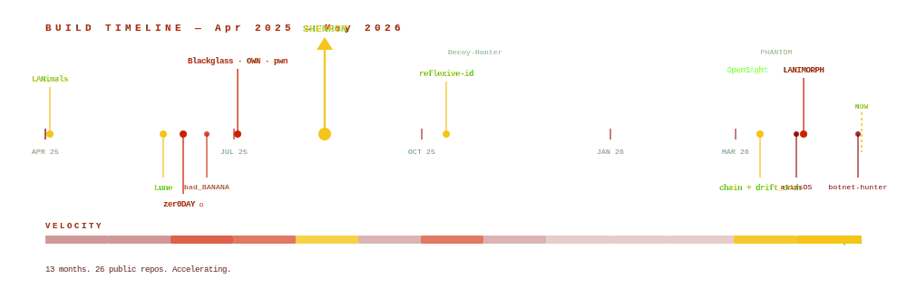
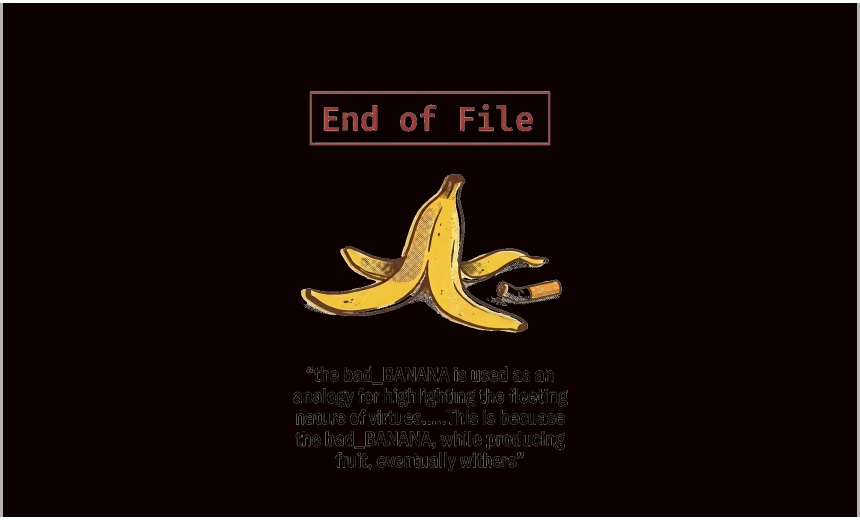

---

---

<table width="100%"><tr>
<td width="25%" valign="top" style="font-family:monospace;">

<code style="color:#cc2200;font-weight:bold;">GITHUB</code> 
<code><strong>41</strong> stars</code> 
<code><strong>102</strong> followers</code> 
<code><strong>953</strong> contributions</code> 
<code><strong>27</strong> public repos</code>

</td>
<td width="25%" valign="top" style="font-family:monospace;">

<code style="color:#cc2200;font-weight:bold;">DEV.TO</code> 
<code><strong>4,270</strong> followers</code> 
<code><strong>43</strong> articles</code> 
<code><strong>8,150</strong> readers (all time)</code>

</td>
<td width="25%" valign="top" style="font-family:monospace;">

<code style="color:#cc2200;font-weight:bold;">BUILD STATUS</code> 
<code>✓ LANimals</code> 
<code>✓ Lune (92 tests)</code> 
<code>✓ drift_orchestrator</code> 
<code>✓ OpenSight (52 tests)</code> 
<code>✓ chain · aliasOS · zer0</code>

</td>
<td width="25%" valign="top" style="font-family:monospace;">

<code style="color:#cc2200;font-weight:bold;">CONTACT</code> 
<code>preferred:</code> 
<code style="color:#cc2200;"><a href="https://github.com/GnomeMan4201/GnomeMan4201/security/advisories">github advisories</a></code> 
<code>writing:</code> 
<code style="color:#cc2200;"><a href="https://dev.to/gnomeman4201">dev.to/gnomeman4201</a></code> 
<code style="font-size:0.8em;">PGP: <kbd>324C 4301 54C2 3C8E 3956 1B10 0CFD 6761 AA75</kbd></code>

</td>
</tr></table>

---

> *"Every system has an edge. Stand at the edge long enough and you realize the map was never the territory"*
> — Korzybski

---

---

### `TOOL DOSSIERS`

<table width="100%"><tr>

<td width="25%" valign="top" style="border-left:3px solid #f5c518;padding-left:8px;font-family:monospace;">
<strong><a href="https://github.com/GnomeMan4201/LANimals">LANimals</a></strong> 
<code style="color:#cc2200;font-size:0.8em;">RECON / DECEPTION</code> 
Host discovery, behavioral risk scoring, honeypot traps, force-directed graph UI. 
<code style="color:#f5c518;">★7</code> <code style="color:#cc2200;">drift: 0.52▲</code> 
<code style="color:#00aa00;">CI PASS</code>
</td>

<td width="25%" valign="top" style="border-left:3px solid #f5c518;padding-left:8px;font-family:monospace;">
<strong><a href="https://github.com/GnomeMan4201/Lune">Lune</a></strong> 
<code style="color:#cc2200;font-size:0.8em;">ADVERSARY SIM</code> 
64-module framework. Encrypted C2, LLM mutation engine, unified persona system. 
<code style="color:#f5c518;">★7</code> <code>92 tests</code> 
<code style="color:#00aa00;">CI PASS</code>
</td>

<td width="25%" valign="top" style="border-left:3px solid #cc2200;padding-left:8px;font-family:monospace;">
<strong><a href="https://github.com/GnomeMan4201/zer0DAYSlater">zer0DAYSlater</a></strong> 
<code style="color:#cc2200;font-size:0.8em;">POST-EXPLOIT ⚠</code> 
LLM-driven operator, session drift monitoring, mTLS mesh, ephemeral NaCl keypairs. 
<code style="color:#f5c518;">★3</code> <code style="color:#cc2200;">auth envs only</code> 
<code style="color:#00aa00;">CI PASS</code>
</td>

<td width="25%" valign="top" style="border-left:3px solid #f5c518;padding-left:8px;font-family:monospace;">
<strong><a href="https://github.com/GnomeMan4201/drift_orchestrator">drift_orchestrator</a></strong> 
<code style="color:#cc2200;font-size:0.8em;">CORE / CONTROL</code> 
Runtime drift control for LLM sessions. SQLite flight recording, hysteresis policy engine. 
<code style="color:#f5c518;">★ core node</code> 
<code style="color:#00aa00;">CI PASS</code>
</td>

</tr><tr>

<td width="25%" valign="top" style="border-left:3px solid #aaaaaa;padding-left:8px;font-family:monospace;">
<strong><a href="https://github.com/GnomeMan4201/OpenSight">OpenSight</a></strong> 
<code style="color:#888888;font-size:0.8em;">OSINT / INTEL</code> 
Entity extraction, typed knowledge graph, investigation bundles. FBI corpus demo. 
<code>52 tests</code> 
<code style="color:#00aa00;">CI PASS</code>
</td>

<td width="25%" valign="top" style="border-left:3px solid #f5c518;padding-left:8px;font-family:monospace;">
<strong><a href="https://github.com/GnomeMan4201/SHENRON">SHENRON</a></strong> 
<code style="color:#cc2200;font-size:0.8em;">CORE / PIPELINE</code> 
Synthetic adversarial telemetry. 49-layer mutation, Sigma rule eval, detection validation. 
<code style="color:#f5c518;">center of the graph</code>
</td>

<td width="25%" valign="top" style="border-left:3px solid #aaaaaa;padding-left:8px;font-family:monospace;">
<strong><a href="https://github.com/GnomeMan4201/PHANTOM">PHANTOM</a></strong> 
<code style="color:#888888;font-size:0.8em;">DECEPTION / DETECT</code> 
Honeypot fingerprinting. Identifies Cowrie, Kippo, OpenCanary, Thinkst +4. 
<code>fingerprint stack</code>
</td>

<td width="25%" valign="top" style="border-left:3px solid #cc2200;padding-left:8px;font-family:monospace;">
<strong><a href="https://github.com/GnomeMan4201/bad_BANANA">bad_BANANA</a></strong> 
<code style="color:#cc2200;font-size:0.8em;">OFFENSE / MOBILE</code> 
Field-ready, no-root offensive toolkit. Android (Termux) and Debian. 
<code style="color:#f5c518;">★4</code> <code style="color:#cc2200;">field-ready</code>
</td>

</tr><tr>

<td valign="top" style="border-left:3px solid #cc2200;padding-left:8px;font-family:monospace;">
<strong><a href="https://github.com/GnomeMan4201/Blackglass">Blackglass</a></strong> 
<code style="color:#cc2200;font-size:0.8em;">OFFENSE</code> 
Offline AI payload mutation. Termux+Linux. No network. 
<code style="color:#cc2200;">offline · no net</code>
</td>

<td valign="top" style="border-left:3px solid #cc2200;padding-left:8px;font-family:monospace;">
<strong><a href="https://github.com/GnomeMan4201/LANIMORPH">LANIMORPH</a></strong> 
<code style="color:#cc2200;font-size:0.8em;">OFFENSE</code> 
LAN-aware morphing payload. Per-subnet XOR mutation. 
<code style="color:#cc2200;">XOR morph</code>
</td>

<td valign="top" style="border-left:3px solid #f5c518;padding-left:8px;font-family:monospace;">
<strong><a href="https://github.com/GnomeMan4201/reflexive-identity">reflexive-identity</a></strong> 
<code style="color:#888888;font-size:0.8em;">ML / ZERO-TRUST</code> 
Zero-trust AI agent. Self-auth, priv revocation. 
<code style="color:#f5c518;">autonomous agent</code>
</td>

<td valign="top" style="border-left:3px solid #cc2200;padding-left:8px;font-family:monospace;">
<strong><a href="https://github.com/GnomeMan4201/OWN">OWN</a></strong> · <strong><a href="https://github.com/GnomeMan4201/aliasOS">aliasOS</a></strong> 
<code style="color:#cc2200;font-size:0.8em;">OFFENSE · OPS</code> 
Adaptive offensive fw. · Textual TUI, 296 aliases, v1.0.0. 
<code style="color:#00aa00;">CI PASS</code> (aliasOS)
</td>

</tr></table>

<code style="color:#8b0000;">ALSO BUILT:</code> [`pwn`](https://github.com/GnomeMan4201/pwn) · [`chain`](https://github.com/GnomeMan4201/chain) · [`Decoy-Hunter`](https://github.com/GnomeMan4201/Decoy-Hunter) · [`devto-botnet-hunter`](https://github.com/GnomeMan4201/devto-botnet-hunter) · [`drift-artifact`](https://github.com/GnomeMan4201/drift-artifact)

---

---

<code>◈ SWITCH TO BLUE TEAM // DEFENSE POSTURE MAP</code>

 

